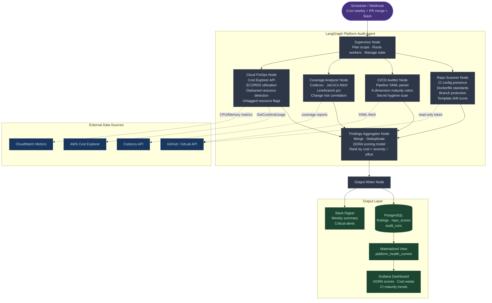

# build-agent-smith

Built LangGraph-based platform audit agent that automatically measured infrastructure standardization, CI/CD maturity, and test coverage across all 28 repositories — gave engineering leadership and FinOps a continuous view into cloud resource utilization patterns and surfaced $120K+ in underutilized compute that was subsequently right-sized.
